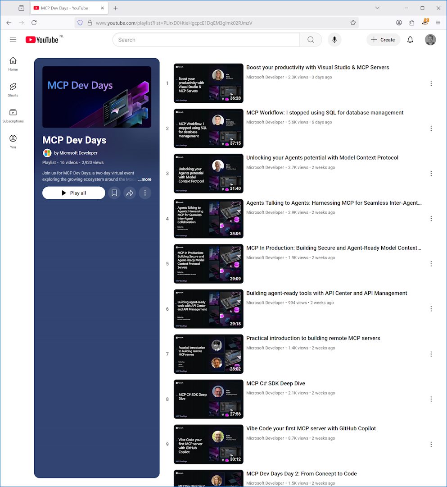

While I was out, MCP Dev Days happened on July 29 and 30. Two days, four hours each, turned into a great playlist of 18 videos. Since I work on Learn MCP, I was happy to see it features in Chris Noring's presentation about Revealing every MCP feature in VS Code.

[YouTube playlist](https://www.youtube.com/playlist?list=PLlrxD0HtieHgcpcE1DqEM3glmk02RJmzV)

Thanks for reading! :-)
