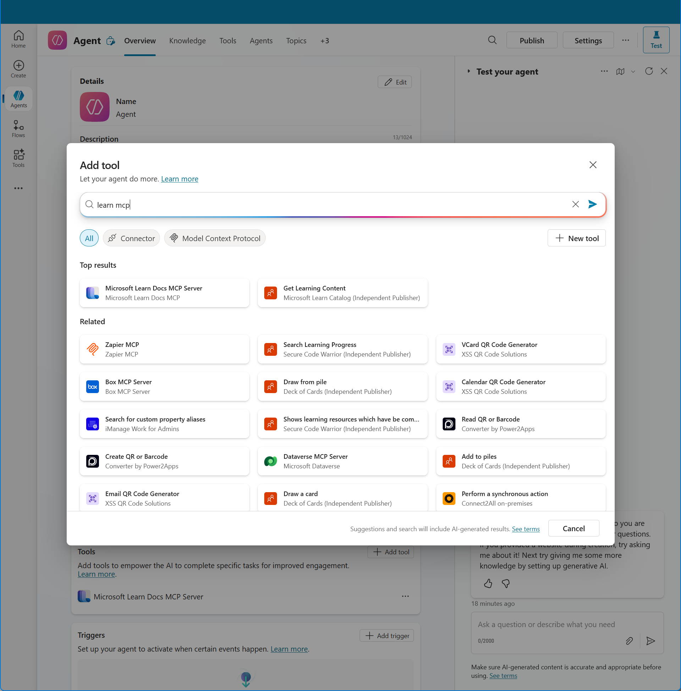

This is a nice development that hasn't gotten much attention: You can now add an MCP server to a Copilot Studio agent using just a wizard!

Previously, I have worked with a number of people to document how to add Learn MCP Server to a Copilot Studio agent by creating a custom connector using swagger. This was clearly not a simple approach that required more technical knowledge than you would expect from the average power user. Next I also spent quite some time to create a certified connector for Learn MCP Server, that would help users to simply click on an existing connector in the marketplace. While we succeeded in doing this, the process wasn't easy and took a long time to deploy globally, which doesn't work for the pace in which AI and MCP Servers are developing. So I am happy to see this, not so much for my own work, but for Copilot Studio users and for MCP Server developers. 

[Docs](https://learn.microsoft.com/microsoft-copilot-studio/mcp-add-existing-server-to-agent)

Thanks for reading! :-)
