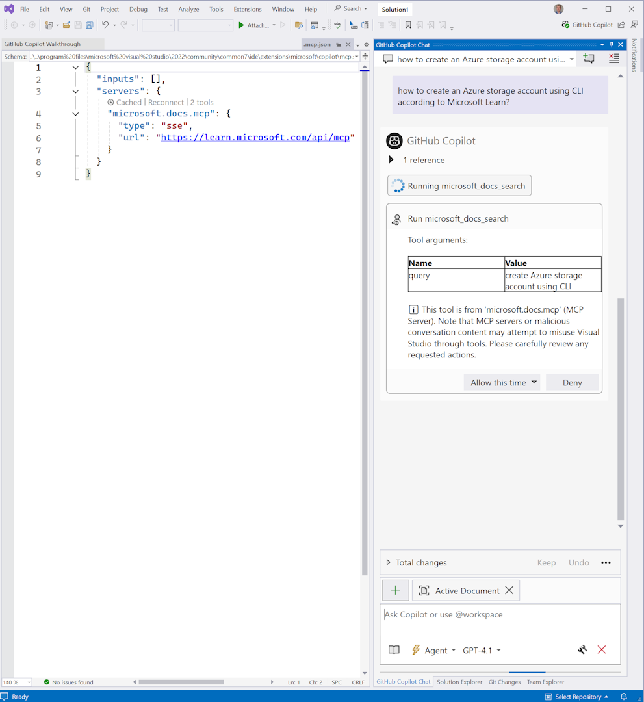

VS Code is the top client of Learn MCP Server. I was investigating why Visual Studio is lower on the list, what it looks like and what can be improved. 

So I thought it would be good to create a one-click install link. The below link works when pasted in a browser, however GitHub has a security feature to only accept http(s) links and rewrite anything else to camo.githubusercontent.com. So this is also a test to see if the blog does accept it. 

vsweb+mcp:/install?%7B%22name%22%3A%22microsoft.docs.mcp%22%2C%22type%22%3A%22http%22%2C%22url%22%3A%22https%3A%2F%2Flearn.microsoft.com%2Fapi%2Fmcp%22%7D%0A

VS Code has a nice workaround using https://vscode.dev/redirect/mcp/install. Visual Studio doesn't have this (yet). 

Update 20250924: I spoke with Gerald Versluis, who brought this up in his team, and they delivered [Visual Studio protocol handlers](https://vs-open.link/). Thanks!

Also works in VS2026 Insiders!

Thanks for reading! :-)
