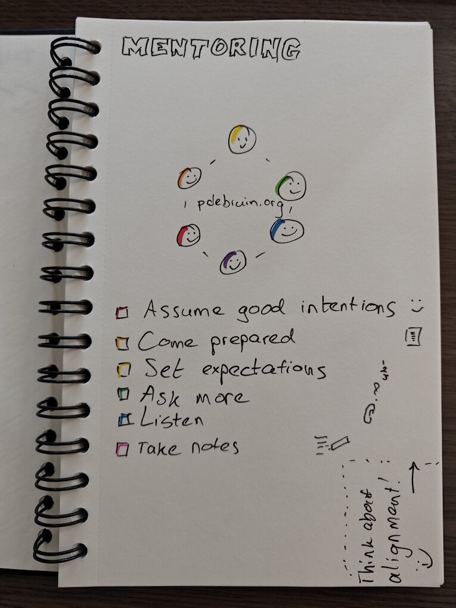

Most of the times I write notes on technological developments, since that space moves quickly. This week however, I wanted to write about mentoring. Apparently I haven't blogged about mentoring before, and it is a crucial part of our jobs. Creating code or content on your own is interesting and moves faster, but talking with others, asking questions, sharing learning, etc is also essential. 

This week I co-hosted another mentoring ring meeting. During those conversations, you zoom out of your daily business, and talk about what is important. Doing your job, yes. Telling others about your impact, yes. Asking for feedback, yes. Having open conversations with experienced colleagues, yet. Talking with people who can influence your road ahead, yes. Etc. 

I don't care much about nuances between coaching, mentoring, and other related words. Everyone has their own association with them and that is fine. In essence, the point it that you are creating a person connection, and have a personal challenge or question that you want to talk about. Regardless of the name of the relationship or the people involved, there can be a match or not. 

Some things are clear: you can talk about HR related things with anyone, but only your manager can influence salary, bonus, promotion, and other things you may care about. Also some things are sensitive: for instance, you may be interested in another job, and some managers may be able to be great supporters and facilitators, while others will take that as insult or proof of missing motivation. This is not about bad managers and how to handle them, because that deserves a complete separate post, and I have plenty of examples unfortunately.

Another thing is clear: calling people mentors and mentees sets incorrect expectations. The way I see it is that everyone brings their own personality, values, talents, education, experience, etc. Sure, some may have been in a role or company longer than others, and hence have more to share. Communication and mentoring is always a two-way street where both participants can learn from themselves and from others.

Thanks for reading! :-)
