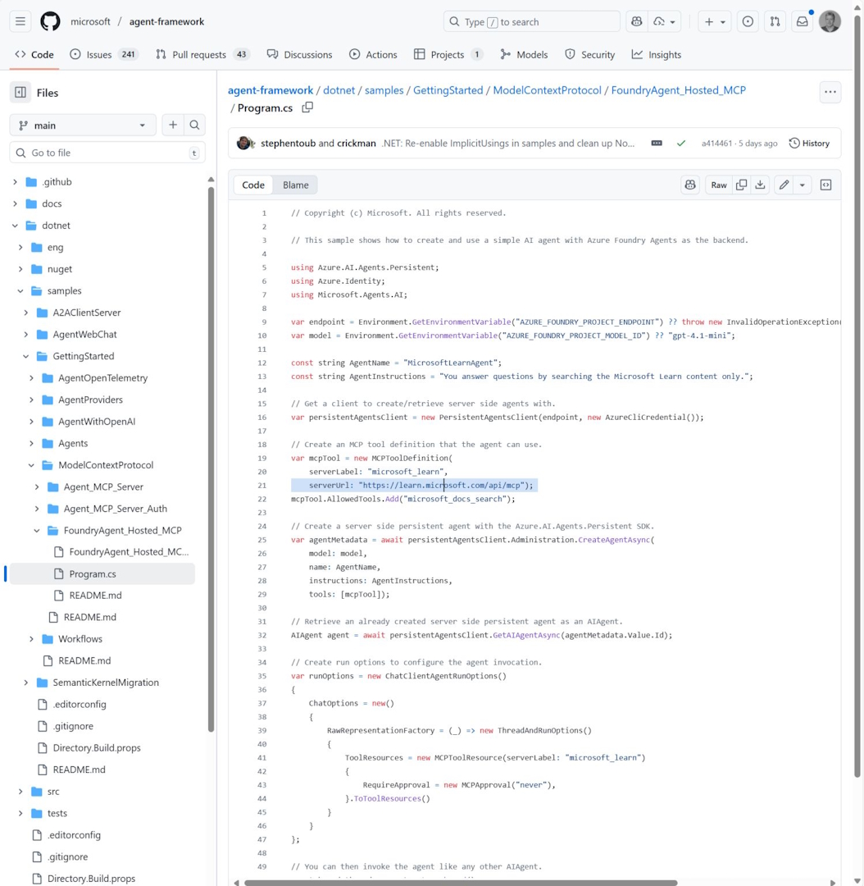

"The innovation of AutoGen and the trust and stability of Semantic Kernel — in one unified framework"

While all of this is new, I created a video that shows the C# sample of connecting with Learn MCP Server, see below. And I recommend the table in the blog post that compares semantic kernel, autogen, and the new agent framework to understand details.

[Blog post](https://devblogs.microsoft.com/foundry/introducing-microsoft-agent-framework-the-open-source-engine-for-agentic-ai-apps/)

[Agent Framework](https://github.com/microsoft/agent-framework)

[Learn MCP Server](https://github.com/microsoftdocs/mcp)

[Demo video](https://youtu.be/nfHWS1S6_pQ)

Thanks for reading! :-)
