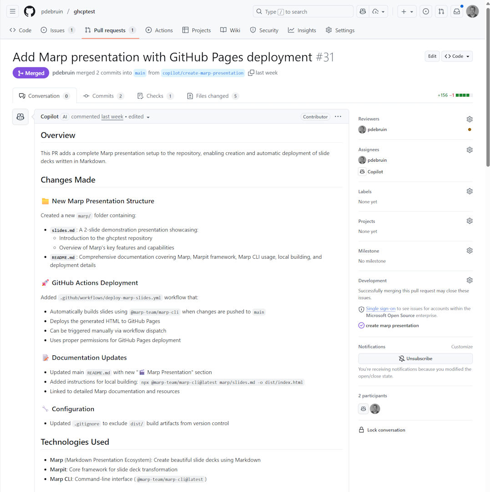
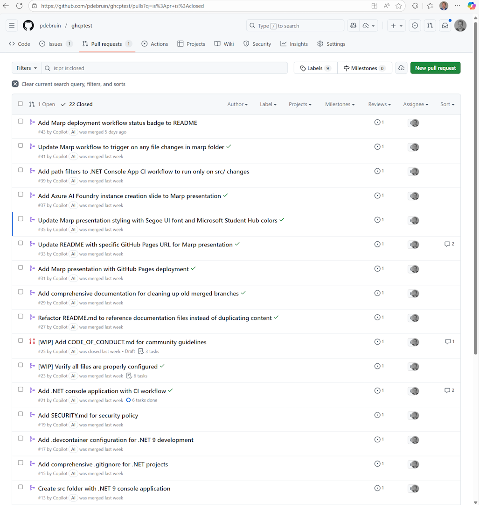

Recently I saw a recorded presentation that used GitHub Copilot really as an assistant to get things done and the audience was very impressed. So I thought to demonstrate this and to write about it. 

As you may know, I joined the Learn partnerships integrations team in May and have been working on Learn MCP Server adoption since then. This has forced me to use VS Code with GitHub Copilot on a daily basis. But GitHub Copilot doesn't need VS Code; it also lives online on github.com. 

To start this demonstration, I wanted Copilot to create all artifacts in the code section of a new GitHub repository, and I would only interact by creating GitHub issues and assign them to Copilot. Copilot then does its best to create things, which I will have to approve by processing the Pull Requests. 

My goal was to create: 
* a dotnet 9 app, with devcontainer since GitHub codespaces only does dotnet 8 by default, and
* a Marp presentation, created in markdown and run on GitHub Pages.
* And actions, and a readme, etc.

Note, I only created issues with a title to explain the task, assigned them to copilot, and merge the pull request. 23 PRs later, I stopped playing. See the end result here 

[Repo](https://github.com/pdebruin/ghcptest/)

Pretty impressive, right? 

Biggest takeaway: While work is in progress [WIP], don't touch the issue or pull request and let it do its work. Duh! :-)

Thanks for reading! :-)
