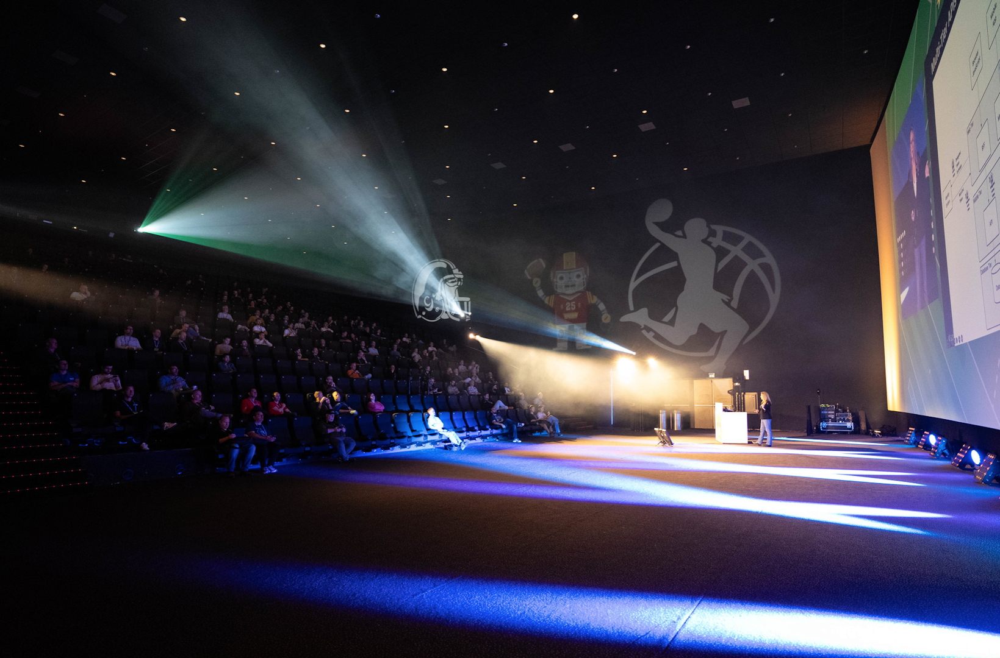

This week I volunteered at Techorama for two days. I like how various types of IT engineers join at an event to learn, discuss, share information. The easiest way to join an event is by paying for an entry ticket, which my employer doesn't do. The next way to join an event for free is to present at it, which I occasionally do but there are others who need the spotlight and seem to enjoy it more. In the past I have also worked at sponsor booths as a way to get in. More recently I have started volunteering to help organize the event. It is a great way to get in, get backstage, network with presenters whose topics I relate to, and contribute to a great community event. 

The event is held in Utrecht, which I live close to, and takes over a real cinema, which is great since it offers big screens, good sound, and comfortable seats. This is probably one of the bigger developer oriented events in the Netherlands, so if you are interested you should definitely check out it and investigate one of the ways to join the fun. 

[Techorama](https://techorama.nl/)

Thanks for reading! :-)
