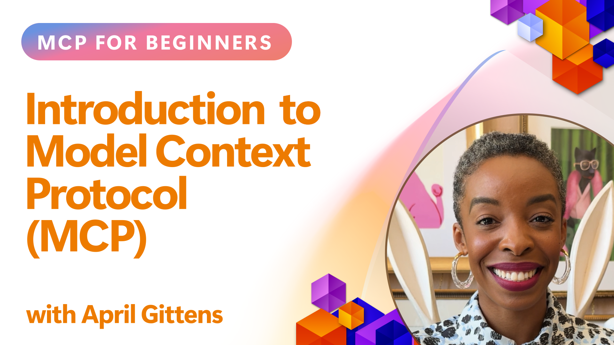

Last week I wrote about Techorama. What was interesting is that I saw Laurent Bugnion's presentation in which he asked the audience whether they had heard about MCP: 2/3 of the room raised their hand. Then he asked whether they had heard about MCP before the event: 1 person raised their hand.

My takeaway was that sometimes we live in a bubble, where we work with a technology every day and it becomes common to us. Then a community event is a great way to pause your busy work, look up, talk to people you haven't met before and exchange stories. In this case, my work is on Learn MCP Server every day, and although MCP has only been out for a year, it can feel like the whole industry is involved with MCP too. And then all of a sudden you realize this is your expertise, and others will have built up new expertise in that same time, and now you should talk about it, what you like, what you don't, where your questions are, etc. 

If you are one of those who have not investigated Model Context Protocol yet and want to, this could be for you. 

I like this style of learning: lots to choose from and in separate sections. If you want to see it all, go through it sequentually, and if you are looking for something specific you can also dive in to one section ad-hoc. 

[Repo](https://github.com/microsoft/mcp-for-beginners/tree/main/00-Introduction)

Thanks for reading! :-)
