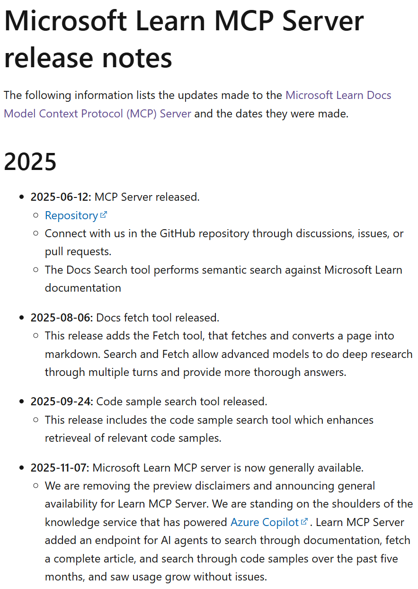

Learn MCP Server is generally available! That is it. That is the post. :-) 

Honestly, this was a bit of a surprise: Someone asked in the GitHub repository about the state of the MCP Server, since they want to use it in production. My colleagues in engineering and product had never spoken about it, because we didn't go through stages like private and public preview officially. You could also say that Learn MCP Server is just another endpoint to an existing platform, which isn't a paid product in itself. And Learn MCP Server stands on the shoulders of giants, since it builds on the [knowledge service](../rag-enabled-ai-apps/), a vector store, that powers services like Ask learn and Azure Copilot. 

In short, the change to generally available was a formality for us. You can see in the release notes that we did make some updates along the way, including publication of additional MCP Tools, while other updates are more internally focused. Most of the work has been on integration and adoption scenarios, that allow you to use Learn MCP Server in VS Code, various marketplaces including Foundry Tools Catalog and Copilot Studio certified connector, and Learn MCP Server is used in a number of in-product copilots that maybe less obvious from the outside. 

[Repo](https://github.com/microsoftdocs/mcp)

[Docs](https://learn.microsoft.com/training/support/mcp)

Learn MCP Server is written in C#. If you would like to build your own MCP Server, you can start to potentially reuse: 

[remote mcp webapp](https://github.com/azure-Samples/remote-mcp-webapp-dotnet)

[remote mcp functions](https://github.com/azure-Samples/remote-mcp-functions)

Or start from scratch. Then at least, watch the latest MCP sessions from dotnetconf. 

[YouTube playlist](https://www.youtube.com/watch?v=YDhJ953D6-U&list=PLdo4fOcmZ0oXtIlvq1tuORUtZqVG-HdCt)

Thanks for reading! :-)
