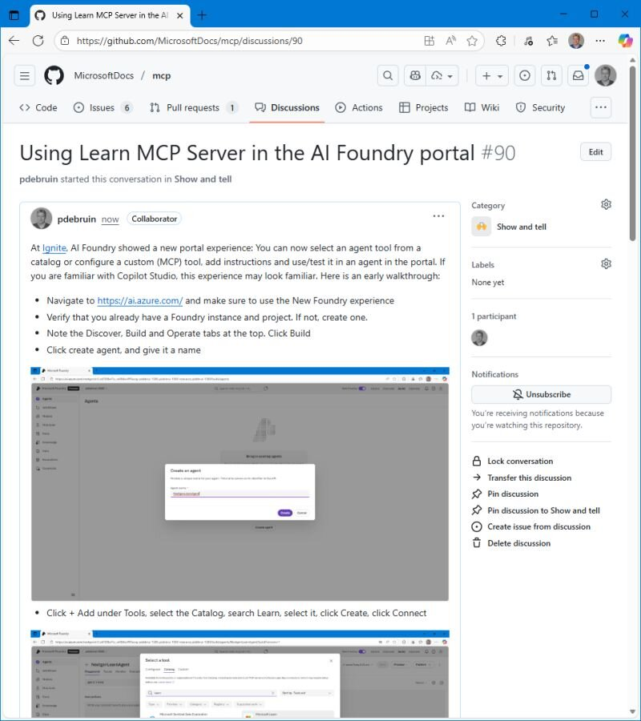

Need something to read? 👀 Ignite 2025 [book of news](https://news.microsoft.com/ignite-2025-book-of-news/) is here! 📖 With 35 (!) mentions of MCP 🎉 

Yesterday was the first day of Microsoft Ignite with long keynotes and lots of presentations that started after European business hours. The good thing about this, is that I can go to sleep and start the day reviewing recorded presentations, note all the interesting stuff, skip the rest, decide what's in it for me, and try it out. What does this mean for you? Well you can see a tailored walkthrough of: 
✨ [Using Learn MCP Server in the AI Foundry portal](https://github.com/MicrosoftDocs/mcp/discussions/90) ✨

Thanks for reading! :-)