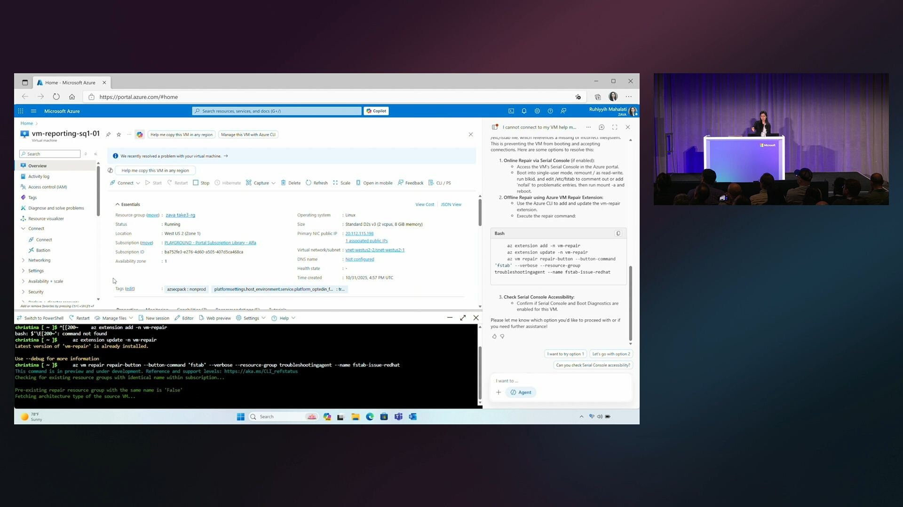

Overwhelmed by AI developments? Looking to understand concepts and to identify components to help answer customer questions? Check out the recording of [Build agents with knowledge, agentic RAG and Azure AI Search](https://ignite.microsoft.com/sessions/BRK193) by Pamela Fox and Matthew Gotteiner

[Repo with demo app](https://github.com/Azure-Samples/azure-search-openai-demo)

"I cannot connect to my VM, help me troubleshoot" 🤔
New in Azure Copilot: Diagnose 🔍 and fix 🎉 
Sounds interesting? Check out MSIgnite session: [Introducing the new Azure Copilot for the new era of Intelligent Agents](https://ignite.microsoft.com/sessions/BRK145)

Thanks for reading! :-)
