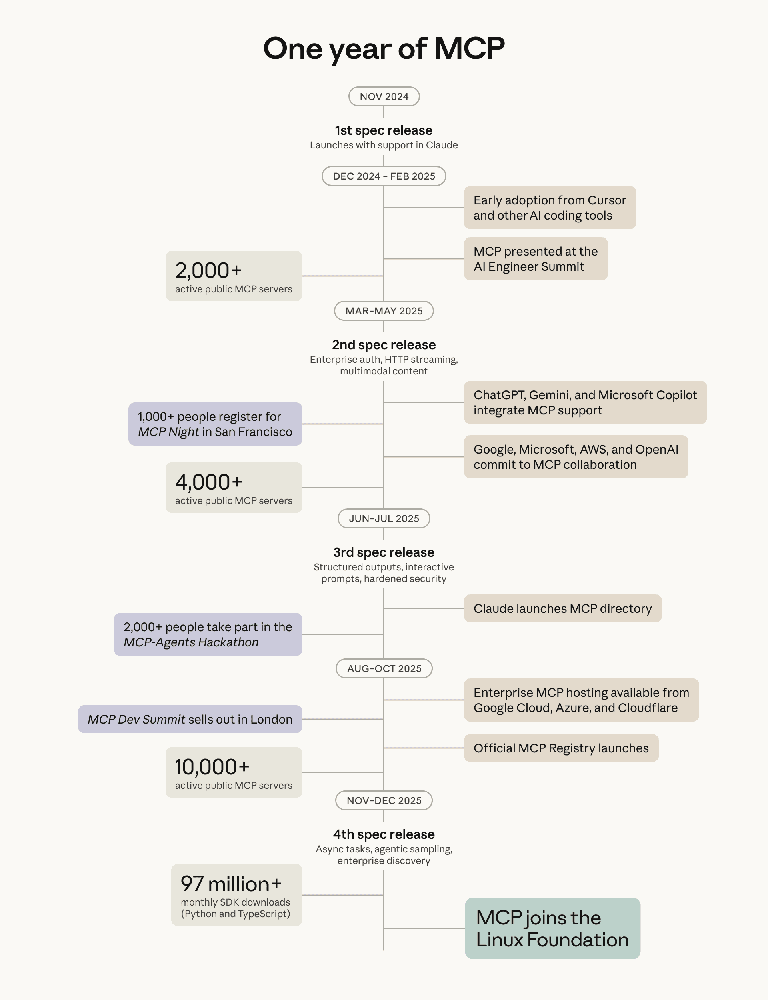

https://www.anthropic.com/news/donating-the-model-context-protocol-and-establishing-of-the-agentic-ai-foundation
 
 https://devblogs.microsoft.com/dotnet/microsoft-learn-mcp-server-elevates-development/

[Repo](https://github.com/pdebruin/ghcptest/)

Thanks for reading! :-)
