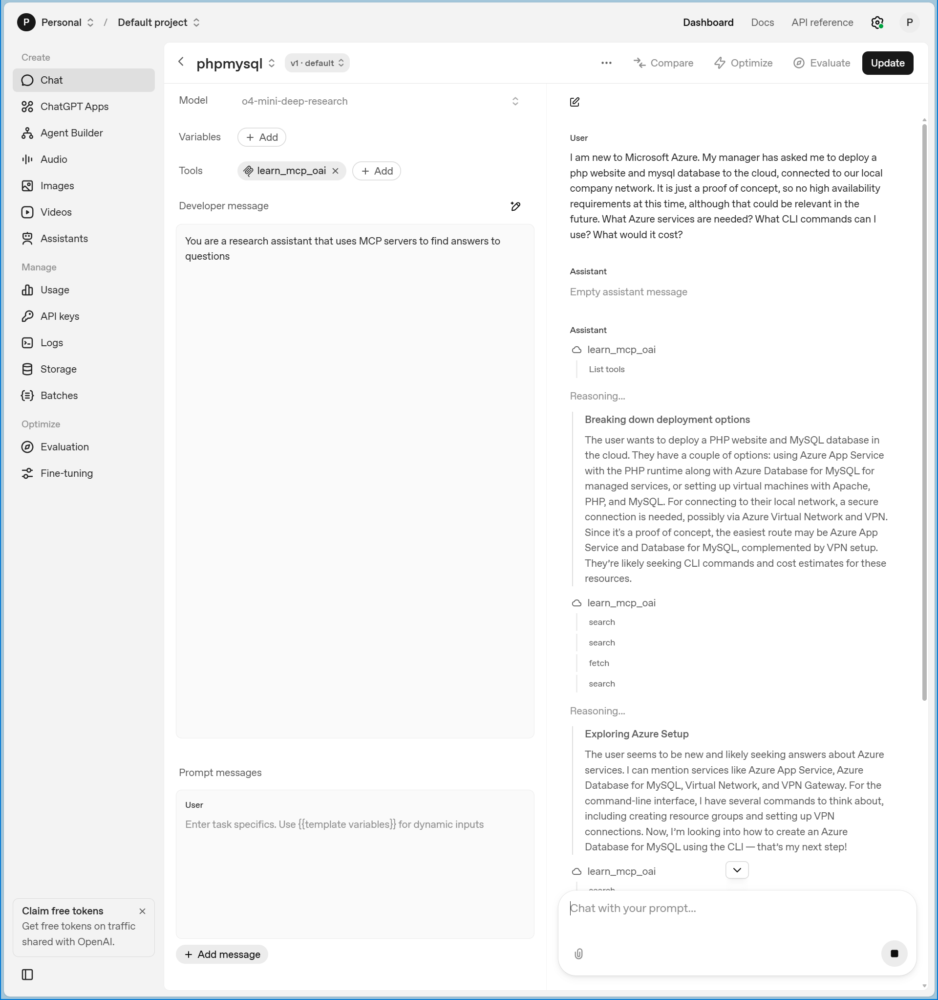

Microsoft Learn MCP Server now supports OpenAI deep research pattern using [search and fetch](https://github.com/MicrosoftDocs/mcp/discussions/94) MCP tools 

Learn MCP Server first started with search functionality in June 2025 and added fetch functionality in August. We were planning to add code sample search from the start, so called the docs search and fetch tools microsoft_docs_search and microsoft_docs_fetch respectively. Although this helps agents understand what to expect from the tools, it doesn't follow OpenAI's convention for [deep research](https://platform.openai.com/docs/mcp). Earlier this month we published another endpoint that does follow OpenAI's [search and fetch pattern](https://github.com/microsoftdocs/mcp?tab=readme-ov-file#-the-microsoft-learn-mcp-server-endpoint)

Thanks for reading! :-)
