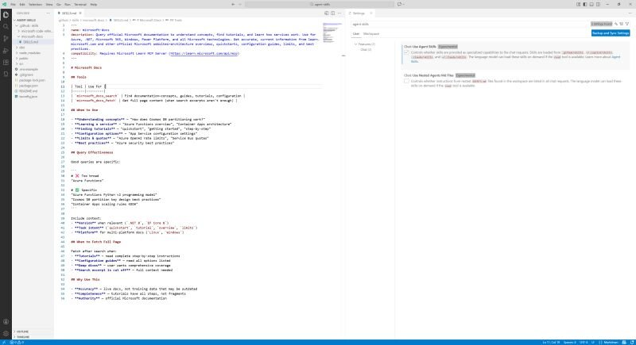

Do you know about [Agent Skills](https://agentskills.io/)? 

That Learn MCP Server publishes [its skills](https://github.com/MicrosoftDocs/mcp/tree/main/skills)? 

And that VS Code Insiders [supports agent skills](https://code.visualstudio.com/
docs/copilot/customization/agent-skills)? 

[Video of Agent Skills aka Skills.md in VS Code](https://www.youtube.com/watch?v=rIrxkB-02P0)

Thanks for reading! :-)
