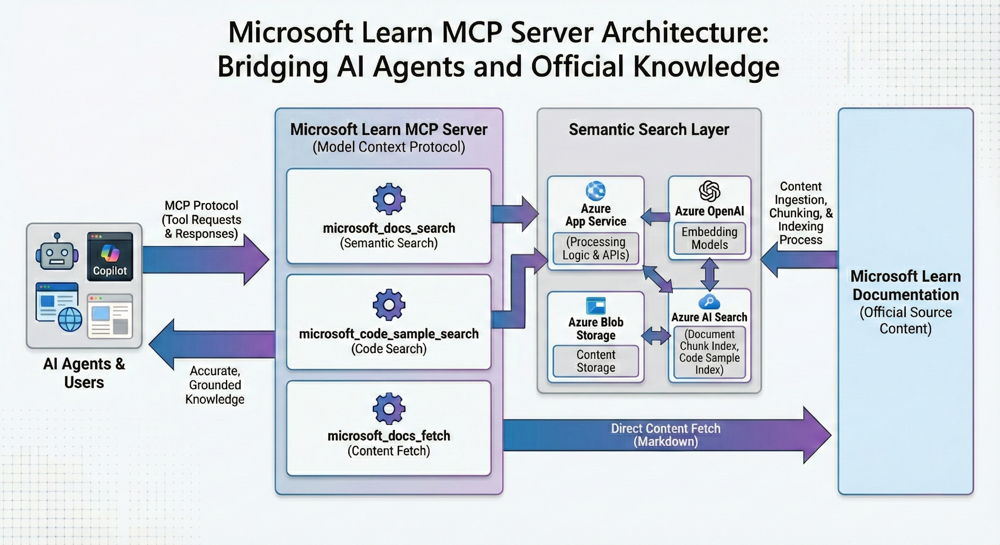

If you have been around the Microsoft ecosystem since May 2025, you may have heard about Microsoft Learn MCP Server. 

Without it, agents and language models use statistics, token prediction, to answer user questions. Or they may do a web search, which is inefficient and may use a random post by a random person that is good in search engine optimization. 

With Learn MCP Server, your agent has a direct connection to Learn content, which is trusted and up-to-date, and the answer quality increases drastically.

Previously the Learn team described [how we built the RAG-based knowledge service](https://devblogs.microsoft.com/engineering-at-microsoft/how-we-built-ask-learn-the-rag-based-knowledge-service/). Now we have also published [how we built Learn MCP Server](https://devblogs.microsoft.com/engineering-at-microsoft/how-we-built-the-microsoft-learn-mcp-server/), which builds on knowledge service. 

Thanks for reading! :-)
