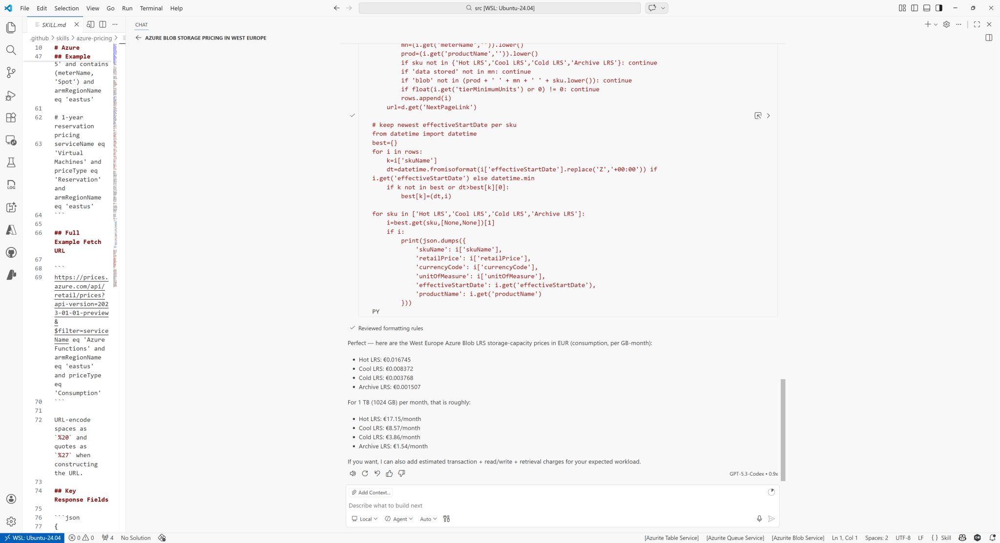

Did you know you can chat with an API?! The Azure Functions team recently published a [blog post](https://techcommunity.microsoft.com/blog/TODO) about hosting declarative markdown agents. It goes into MCP configuration, agents and skills. They included a sample which connects with Learn MCP Server, that we know and love.

[Sample on GitHub](https://github.com/TODO)

But here is the most interesting part that I found: it contains a custom skill that connects GitHub Copilot to the Azure prices API, explains how the API works, and allows it to get real-time pricing info.

Obviously cost estimation is a separate area that should be treated with disclaimers in a pay-as-you-go model, but the point is that I could interact with a traditional API in human language and ask it something like "how much does azure blob storage cost in west europe?". Try for yourself and share your feedback.

Thanks for reading! :-)
