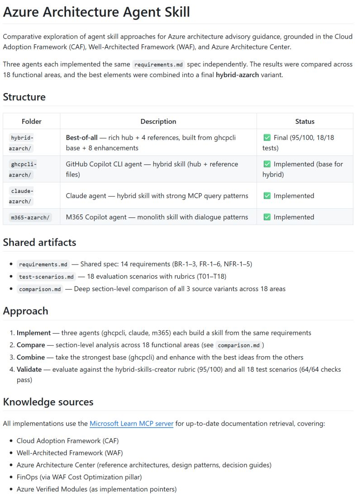

Have you experimented with AI agent skills? MCP Servers and skills combine really well, since MCP Servers provide knowledge and skills provide behavior.

Learn MCP Server published skills 2 months ago. Last week I wanted to define my own skills and came up with a Foundry agent skill and an Azure architecture agent skill.

Try for yourself. Feedback welcome!

[Agent skills documentation](https://code.visualstudio.com/docs/copilot/copilot-customization)

[Foundry agent skill](https://github.com/pdebruin/foundry-agent-skill)

[Azure architecture agent skill](https://github.com/pdebruin/azarch-agent-skill)

Thanks for reading! :-)
