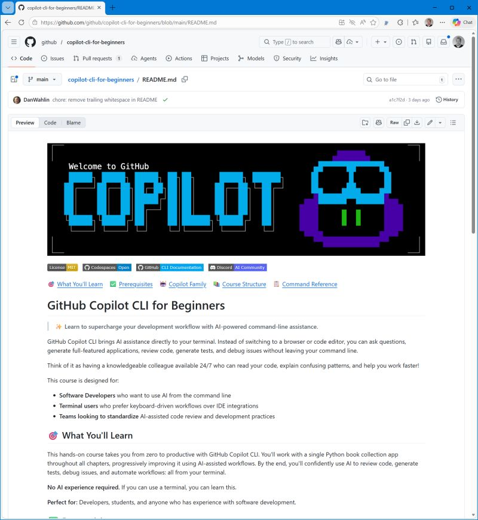

Copilot in IDE vs CLI? You can have both!

VS Code works with GitHub Copilot agent mode AND GitHub Copilot CLI works in the terminal. Actually nowadays I work in split screen mode with Windows terminal running Ubuntu on the left and VS Code on the right: Let GitHub Copilot CLI do the work and check input and output in VS Code. It automatically gets you in the flow of documenting requirements and test cases before getting into coding.

To learn more about GitHub Copilot in the command line, there is a new for beginners series that guides you from installation and first steps to using MCP Servers including Learn MCP Server.

Thanks for reading! :-)
