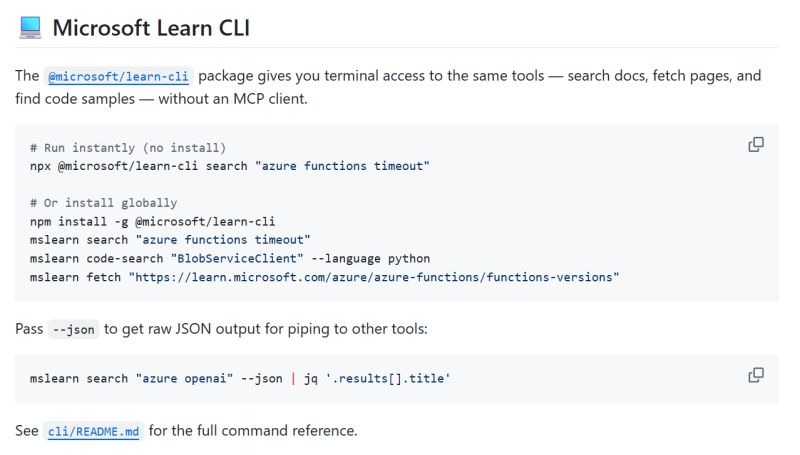

Learn MCP Server keeps expanding to new surfaces.

Learn CLI gives you terminal access to the same tools — search docs, fetch pages, and find code samples — without an MCP client.

```
$ npx @microsoft/learn-cli search "how to create a foundry instance using cli"
```

[NPM package](https://www.npmjs.com/package/@microsoft/learn-cli)

And for Claude Code users, the microsoft-docs plugin is now available in the official marketplace.

```
/plugin | Discover: microsoft-docs
```



What is interesting is that agents with skills are increasingly capable of invoking CLI tools directly. TODO: expand on this angle.

[Learn MCP repo](https://github.com/MicrosoftDocs/mcp)

Feedback? [GitHub discussions](https://github.com/MicrosoftDocs/mcp/discussions)

Thanks for reading! :-)
